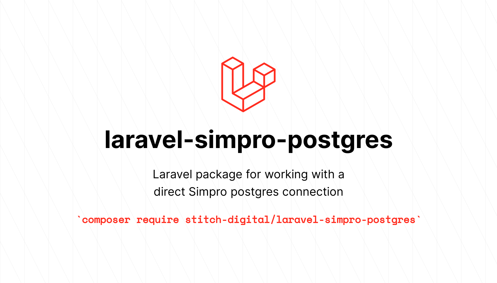

# Laravel package for working with a direct Simpro postgres connection

[](https://packagist.org/packages/stitch-digital/laravel-simpro-postgres)
[](https://packagist.org/packages/stitch-digital/laravel-simpro-postgres)




This is a lightweight package to help connect to the Simpro Postgres database within a Laravel project, rather than connecting to the Simpro API to retrieve data.

It also contains a number of helper functions to make it easier to work with the data, as the schema is not named in the same way as the API - making establishing SQL queries..... interesting.

## Installation

You can install the package via composer:

```bash
composer require stitch-digital/laravel-simpro-postgres
```

Add the following to your `.env` file:

```bash
SIMPRO_DB_HOST=
SIMPRO_DB_PORT=5432
SIMPRO_DB_USERNAME=client_readonly
SIMPRO_DB_PASSWORD=
```

## Usage

Simpro requires whitelisted domain access to their connections. Please ensure that you have whitelisted your local fixed VPN IP address and also your production server.

```php
// Usage description here
```

### Testing

```bash
composer test
```

### Changelog

Please see [CHANGELOG](CHANGELOG.md) for more information what has changed recently.

## Contributing

The Simpro database schema is not very well documented externally and is vast. Therefore I will be building this package out as I go, adding more helpers and functionality over time as I implement it in client projects.

Contributions are welcome and will be fully credited! Contributions are accepted via Pull Requests on [Github](https://github.com/stitch-digital/laravel-simpro-postgres).

### Security

If you discover any security related issues, please email john@stitch-digital.co instead of using the issue tracker.

## Credits

-   [John Trickett](https://github.com/stitch-digital)
-   [All Contributors](../../contributors)

## License

The MIT License (MIT). Please see [License File](LICENSE.md) for more information.
